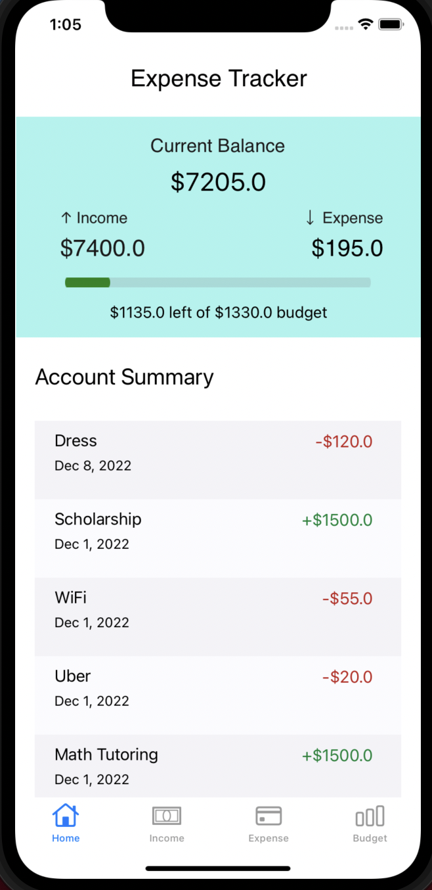
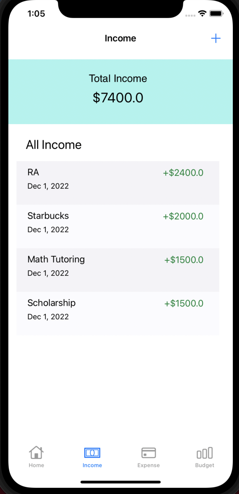
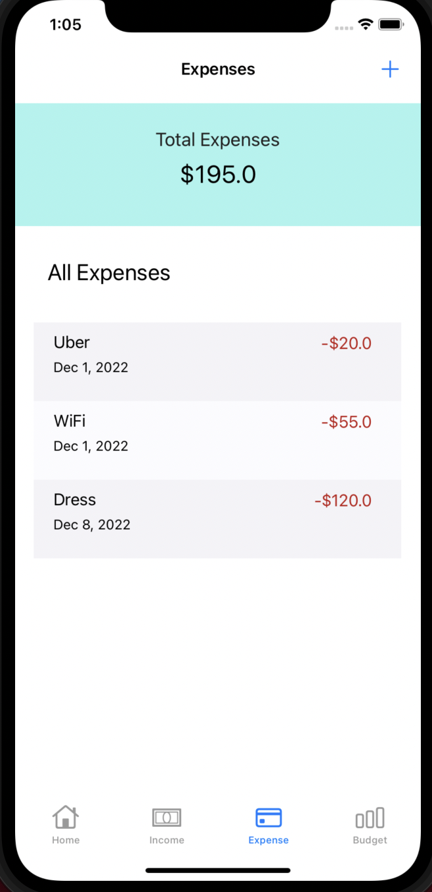
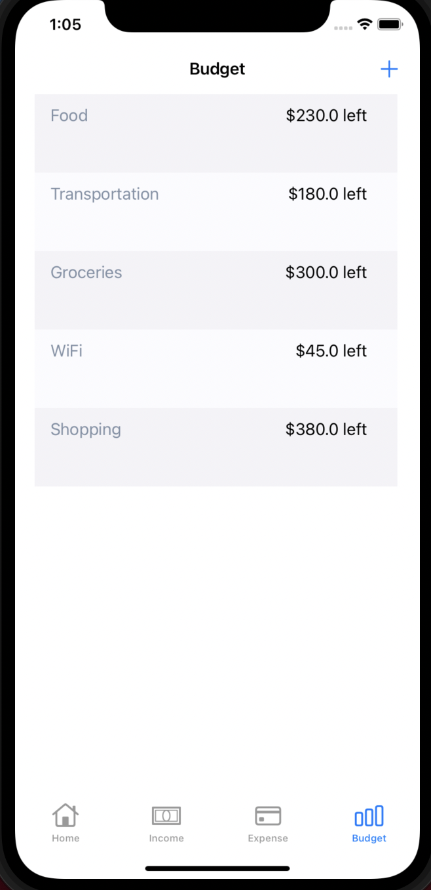
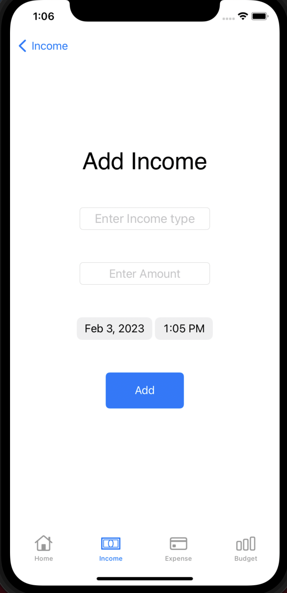
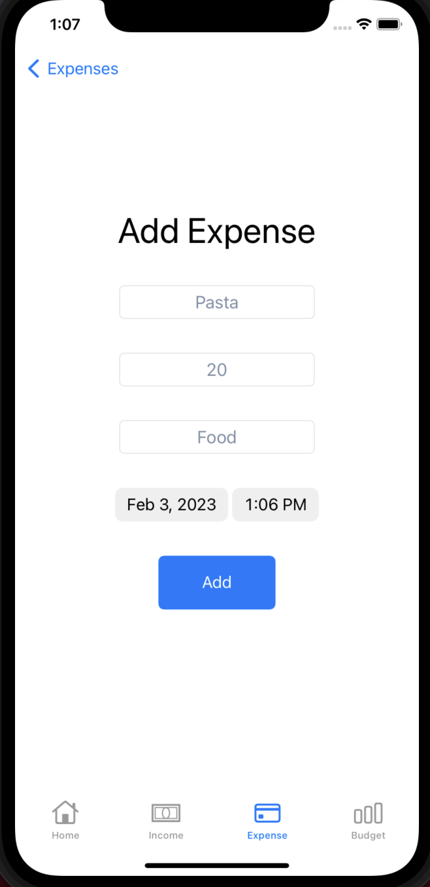
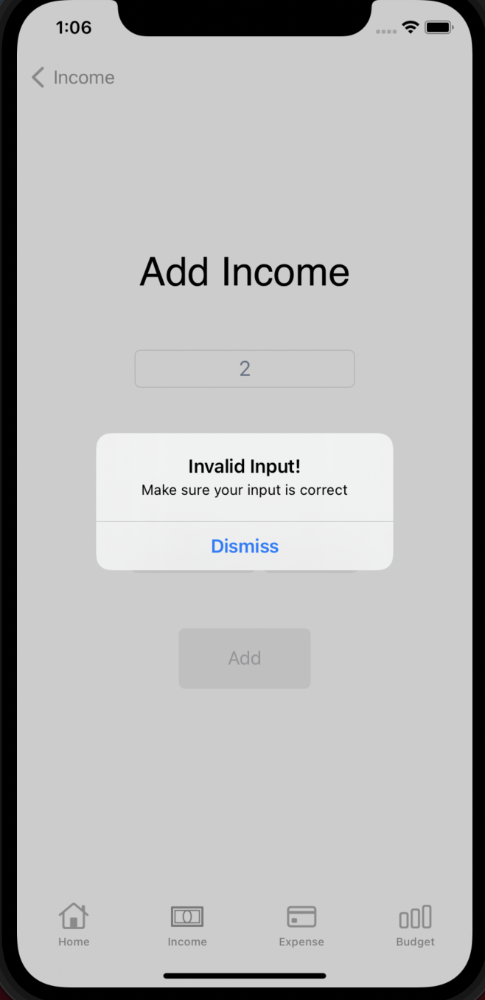
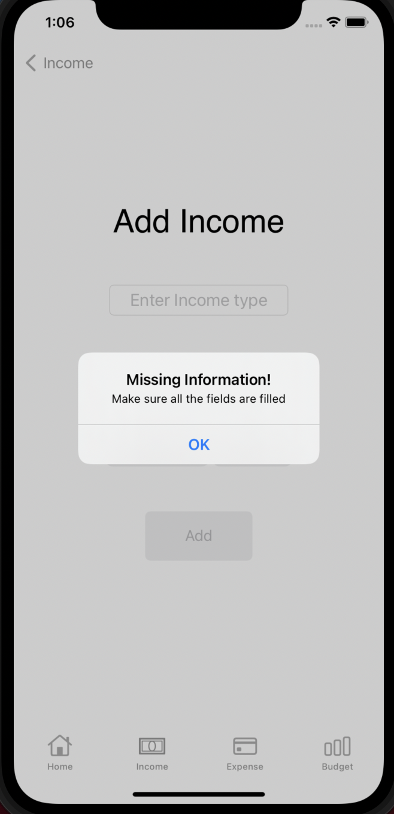

# Expense-Tracker

## Description

This app provides the user the ability to budget their income and keep track of their expenses. One of the main features of this app is providing the amount of budget left overall and for each individual category. The app allows the user to add expenses, income, and budget categories. This is an iOS app developed using Swift and CoreData frameowork.

## Home composition:
In the home tab the current balance is shown at the top, while the total income and total expenses is shown below it. Under that the account summary is displayed which shows all the income and expenses entered in list form. These entries include the name, date, and the amount in red or green to the right of the name. 

## Expenses composition:
User can see a list of expenses entered including the name, date, and total amount for each expense in list form. This information is shown in a list form with the total expense amount at the top and all the expenses below it, including the name, the date, and the amount in red to signify a deduction in funds. 
 In this feature the user can also add expenses by entering the expense name, date, and total amount by clicking the add icon in the tab bar. In order to categorize this information, the user must choose a category from a dropdown menu including all categories previously entered in the budget tab. 

## Income composition:
The user can see a list of all income entered including the name and total amount in list form. In this feature the user can also add income by entering the name and total amount.  Once the income is entered it will show up on the income tab list. These items will show the name, with the date below it and the amount in green to the right. The total income entered will be showed at the top and the add icon is at the top right of the page. 

## Budget composition:
The user can also enter budget categories in the budget tab by clicking the top right plus icon and entering the category name and the total amount for it. This will show up in the budget list with the total amount left after all expenses for that category are subtracted. 

## Features

| Home                                                                                                           | Income                                                                                                          | Expenses                                                                                                          |
|---------------------------------------------------------------------------------------------------------------------------|----------------------------------------------------------------------------------------------------------------------|----------------------------------------------------------------------------------------------------------------------|
|  |  |   |

| Budget                                                                                                           | Add Income                                                                                                          | Add Expense                                                                                                          |
|---------------------------------------------------------------------------------------------------------------------------|----------------------------------------------------------------------------------------------------------------------|----------------------------------------------------------------------------------------------------------------------|
|  |  |   |

| Invalid Input                                                                                                           | Missing Info                                                                                                          |
|---------------------------------------------------------------------------------------------------------------------------|----------------------------------------------------------------------------------------------------------------------|
|  |  | 

## Authors

* Jahanvi Dave 
* Sneha Seenuvasavarathan
* Ruben Malvaez
